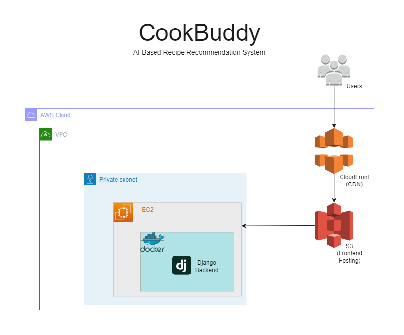

# CookBuddy - AI Based recipe recommendation system

This FullStack web project showcases a user authentication and recipe recommendation system developed using Django, React, and Machine Learning. It features user registration, login, logout, and profile data management, alongside a robust recipe recommendation engine. Authentication is managed with JWT (JSON Web Tokens), and the recommendation system leverages the TF-IDF algorithm for accurate and relevant suggestions. The frontend of the application is hosted on AWS S3, and CloudFront is used as a CDN to deliver content quickly and efficiently to users. The backend is hosted using docker conatiner on EC2.

[Demo Link](https://drive.google.com/file/d/1Yp3sEGMDyrm9HqDNFD2joMEHQmRFzXm-/view?usp=sharing)



## Recipe Recommendation System
The recipe recommendation engine is built using Machine Learning. Data is collected from the Jamie Oliver website using `Web-Scraping` and `NLTK` module for parsing and fine-tuning the data.. It leverages a `Word2Vec model for generating `TF-IDF` rankings of recipes based on ingredients, cuisine style, and user reviews. This approach ensures personalized and relevant recipe suggestions tailored to user preferences. 

## Project directories: 

- `client`: Contains the React application
- `server`: Contains the Django backend
    - `core`: Django backend system
    - `user`: Application logic for authenticatino and recommendation system

## Installation

To run this project on your local machine, follow the steps below:

### Prerequisites

Ensure you have the following installed on your local machine:

- Python 3.9 or higher
- Node.js v16.15.0 or higher
- npm 8.0.0 or higher

### Setup

1. Clone the repository:
    ```
    git clone https://github.com/<yourusername>/<yourrepository>.git
    ```
2. Change into the directory:
    ```
    cd <yourrepository>
    ```

### Server

1. Navigate to the `server` directory:
    ```
    cd server
    ```
2. Install Django and other dependencies:
    ```
    pip install -r requirements.txt
    ```
3. Create a virtual environment (Optional but recommended):
    ```
    python -m venv env
    ```
4. Activate the virtual environment:
    On Windows:
    ```
    .\env\Scripts\activate
    ```
    On MacOS/Linux:
    ```
    source env/bin/activate
    ```
5. Create a `.env` file in the `server` directory and add your secret key like this: 
    ```
    SECRET_KEY=<your-secret-key>
    ALLOWED_HOSTS=<your-allowed-hosts>
    CORS_ALLOWED_ORIGINS=<your-cors-allowed-origins>
    CORS_TRUSTED_ORIGINS=<cors-trusted-origins>
    ```

### Client

1. Navigate to the `client` directory:
    ```
    cd ../client
    ```
2. Install all the dependencies:
    ```
    npm install
    ```
3. Run the client:
    ```
    npm start
    ```
5. Create a `.env.production` and `.env.development` files in the `client` directory and add your secret key like this: 
    ```
    REACT_APP_API_URL=<your-backend-hosted-url> # example: http://127.0.0.1:8000/
    ```

Now, your application should be running at `localhost:3000`.

Note:
- The Django server should be running at the same time as the React application for the system to function properly.
- The application uses the email field instead of the username field for user identification.
- The current recommendation system uses in memory recipe data for recommending the recipies.
